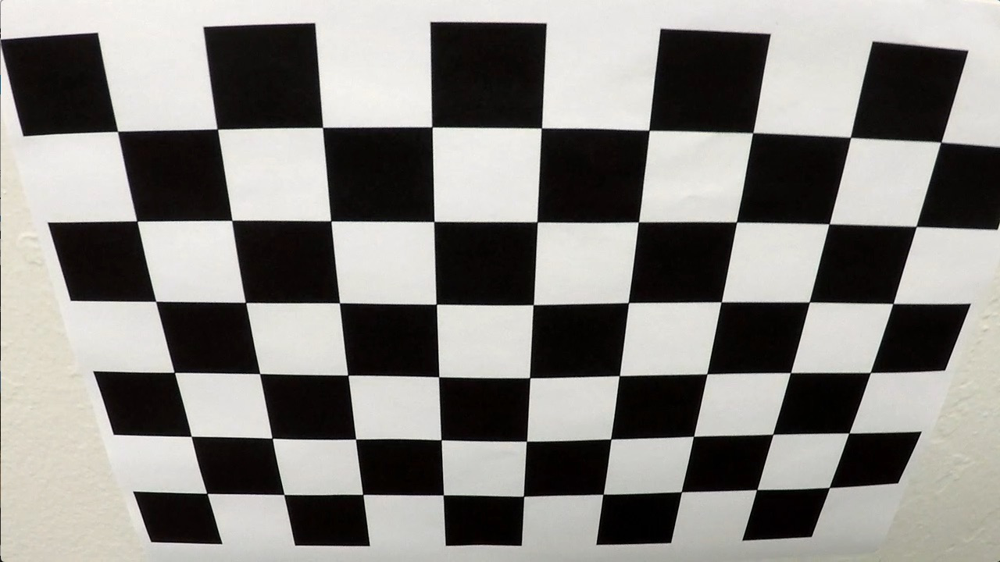
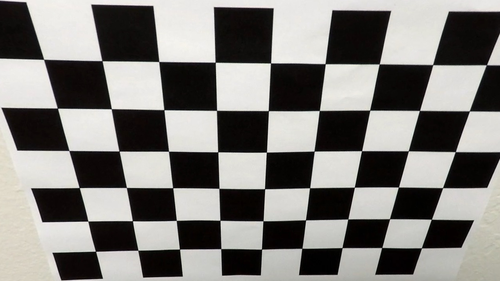
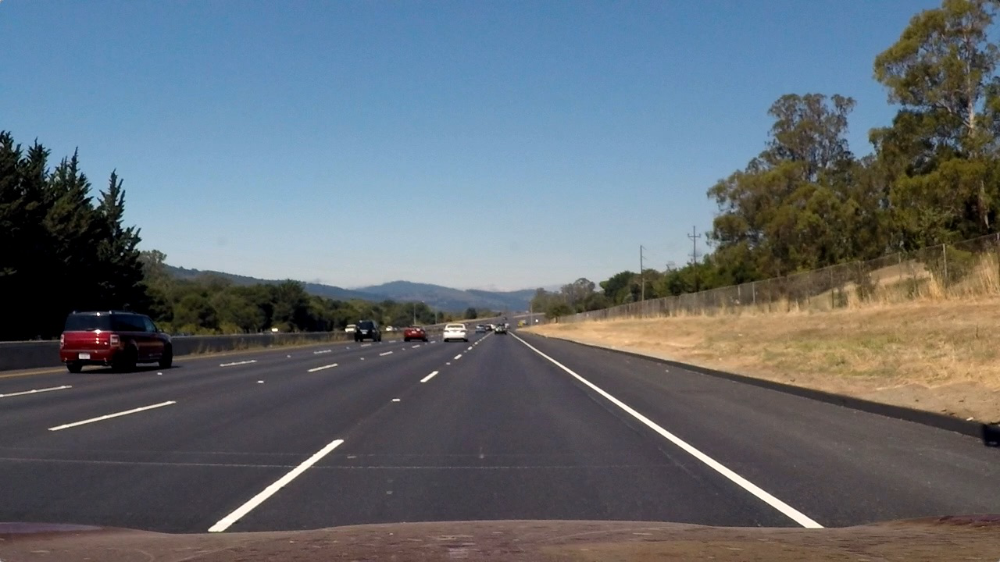
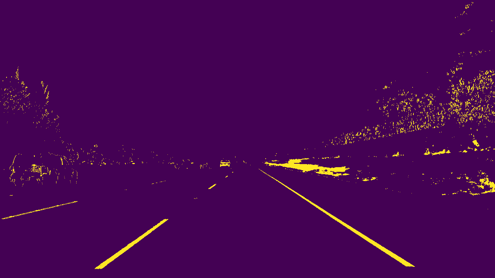
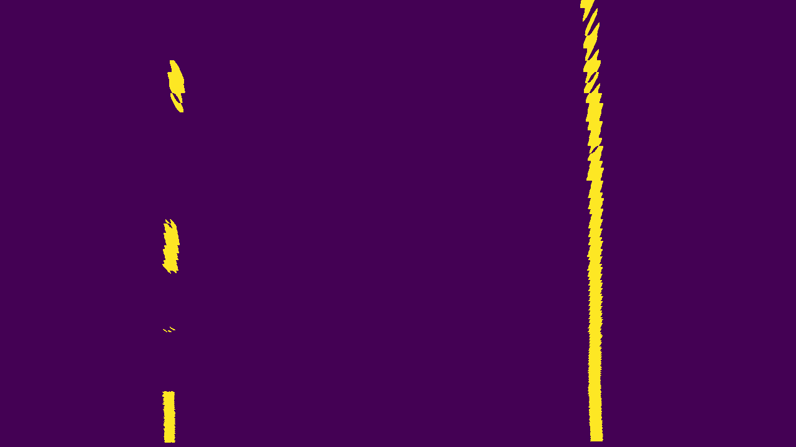
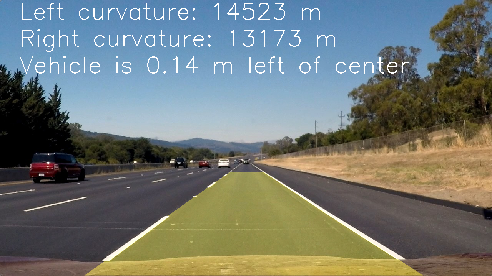

# Advance Lane Lines Finder - Writeup
[](http://www.udacity.com/drive)

## Goals

The goals/steps of this project are the following:

- Compute the camera calibration matrix and distortion coefficients given a set of chessboard images.
- Apply a distortion correction to raw images.
- Use color transforms, gradients, etc., to create a thresholded binary image.
- Apply a perspective transform to rectify binary image ("birds-eye view").
- Detect lane pixels and fit to find the lane boundary.
- Determine the curvature of the lane and vehicle position on center.
- Warp the detected lane boundaries back onto the original image.
- Output visual display of the lane boundaries and numerical estimation of lane curvature and vehicle position.

## [Rubric](https://review.udacity.com/#!/rubrics/571/view) points

### README

### Camera calibration

#### 1. How camera matrix and distortion coefficients are calculated. Also an example of a distortion corrected calibration image.

The camera calibration code could be found on the [undistortImg.py](undistortImg.py) file.<br/>Using `cv2.findChessboardCorners`, the corners points are stored in an array `imgpoints` for each calibration image where the chessboard could be found. The object points will always be the same as the known coordinates of the chessboard with zero as 'z' coordinate because the chessboard is flat. The object points are stored in an array called `objpoints`. I then used the output objpoints and imgpoints to compute the camera calibration and distortion coefficients using the `cv2.calibrateCamera` function. I applied this distortion correction to the test image using the `cv2.undistort` function and obtained this result:

<br/>Original Chessboard
 
<br/>Undistorted Chessboard



#### 2. Provide an example of a distortion-corrected image.

The following image shows the result of applying the camera calibration to one of the test images:

<br/>Original Image
 
<br/>Undistorted Image


#### 3. How color transforms, gradients or other methods are used to create a thresholded binary image.

The code used to generate binary image based on color, gradients and thresholds could be found on the [colorChannel.py](colorChannel.py).

* R channel is used n RGB color space for it's prominent contrast features in case of lane lines. 
* A color transformation to HLS was done using `cv2.cvtColor(image, cv2.COLOR_RGB2HLS)` and the S channel was selected because it was showing more contrasts on the lane lines.
* Then sobel in the x direction is applied as it was showing more prominent resulst using `cv2.Sobel` function.
* Then I have combined R, S, and sobelX and choose whnerver two of the three are activated as activated points.

The following image shows the result of applying these operations to one of the test images:

<br/>Original Image
 
<br/>Binary Image


#### 3. How a perspective transformation is used to get birds eye view.

The perspective transformation code could be found on [warpingImage.py](warpingImage.py). 

* Got four points in the image space and used four points in the trasformed space as source and destination respectibvely.
* Using these source and destination points and `cv2.getPerspectiveTransform`, a transformation matrix was calculated, and an inverse transformation matrix was also calculated reversing source and destination to map the points back to the original space.

The following image shows the result of applying these operations to one of the test images:

<br/>Original Image
 
<br/>Warped Image


#### 4. How lane-line pixels and idetified and fit a polynomial with their positions

The line detection code could be foundfound on [lanePixelDetector.py](lanePixelDetector.py).<br/>The algorithm calculates the histogram on the X axis. Finds the picks on the right and left side of the image, and collect the non-zero points contained on those windows. When all the points are collected, a polynomial fit is used (using `np.polyfit`) to find the line model. On the same code, another polynomial fit is done on the same points transforming pixels to meters to be used later on the curvature calculation. 

The following image shows the result of applying these operations to one of the test images:

#### 5. How the radius of curvature of the lane and the position of the vehicle on the center is calculated.

The curvature detection code could be foundfound on [lanePixelDetector.py](lanePixelDetector.py).<br/>Apolynomial was calculated on the meters space to be used here to calculate the curvature. The formula is the following:
```
((1 + (2*left_fit_cr[0]*y_range*ym_per_pix + left_fit_cr[1])**2)**1.5) / np.absolute(2*left_fit_cr[0])
```
where `fit` is the the array containing the polynomial, `y_range` is the maximum Y value and `ym_per_pix` is the meter per pixel value.

To find the vehicle position on the center:
* Calculate the lane center by evaluating the left and right polynomials at the maximum Y and find the middle point.
* Calculate the vehicle center transforming the center of the image from pixels to meters.
* The sign between the distance between the lane center and the vehicle center gives if the vehicle is on to the left or the right.
This part of code is priectly used in pipeline. The code is as following:
```
# calculate vehicle center
x_max = image.shape[1]*xm_per_pix
y_max = image.shape[0]*ym_per_pix
vehicle_center = x_max / 2
line_left = left_fit_m[0]*y_max**2 + left_fit_m[1]*y_max + left_fit_m[2]
line_right = right_fit_m[0]*y_max**2 + right_fit_m[1]*y_max + right_fit_m[2]
line_middle = line_left + (line_right - line_left)/2
diff_from_vehicle = line_middle - vehicle_center
if diff_from_vehicle > 0:
    message = '{:.2f} m right'.format(diff_from_vehicle)
else:
    message = '{:.2f} m left'.format(-diff_from_vehicle)
```

#### 6. An example image of the results plotted back down onto the road such that the lane area is identified clearly.

To display the lane lines on the image, the polynomials where evaluated on a lineal space of the Y coordinates. The generated points where mapped back to the image space using the inverse transformation matrix generated by the perspective transformation.
<br/>Original Image
 
<br/>Warped Image



### Pipeline (video)

#### 1. Provide a link to your final video output. Your pipeline should perform reasonably well on the entire project video (wobbly lines are ok but no catastrophic failures that would cause the car to drive off the road!).

After some refactoring of the code found at `In [21]`, the project video was processed and the results at [video_output](./video_output/project_video.mp4)

### Discussion

#### 1. Briefly, discuss any problems/issues you faced in your implementation of this project. Where will your pipeline likely fail? What could you do to make it more robust?

- There are a few improvements that could be done on the performance of the process due to repetitive calculations.
- More information could be use from frame to frame to improve the robustness of the process.
- Other gradients could be use (Ex. Laplacian) to improve the line detection.
